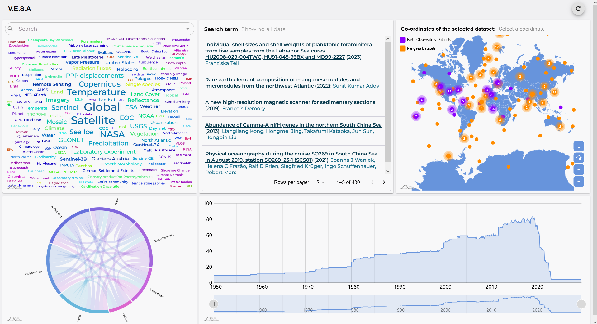

# VESA2  (Visualisation Enabled Search Application)

<p align="center">
  
</p>

Repository for the Visualisation Enabled Search Application. It is a visual exploration and search tool that assists users in navigating through a knowledge graph in an intuitive way. Different visualisations assist in finding information across different dimensions. For example: Map &rarr; Spatial Context, Line Charts &rarr; Temporal context, Network Diagrams or graphs &rarr; interrelations, Word Cloud &rarr; Thematic context. Data is ingested from external sources into a local ArangoDB knowledge graph at setup time. All runtime queries run against the local graph — no live external calls.

[[_TOC_]]

## ✨ Features
You can find a list of the latest changes in the [CHANGELOG](CHANGELOG.md)

## 📋 Prerequisites

Before you begin, ensure you have the following installed on your machine:

- [Docker Desktop](https://www.docker.com/products/docker-desktop/)

That is the only requirement to run the full application stack.

> 💡 **For local development without Docker**
> You will additionally need [Node.js](https://nodejs.org/) v20+ and a locally running ArangoDB instance on port 8529.

## 🚀 Quick Start

Follow these steps to get the application running:

1. **Clone the Repository:**

    ```bash
    git clone <repository-url>
    cd vesa2
    ```

3. **Start the Application:**

    ```bash
    docker compose up --build
    ```

Docker will build and start all three services in the correct order (ArangoDB → Backend → Frontend).

| Service  | URL                    |
|----------|------------------------|
| Frontend | http://localhost:3000  |
| Backend  | http://localhost:5000  |
| ArangoDB | http://localhost:8529  |

ArangoDB credentials: `root` / `root`

> 💡 **TIP**
> To stop the application run `docker compose down`. To also remove the database volume run `docker compose down --volumes`.

## 🔌 Connecting a Data Source

On first run the database is empty. VESA2 ingests data through a local proxy API that fetches records from an external source and transforms them into the [VESA Data Adapter (`IDataAdapter`)](BACKEND/src/ingestion/contracts/IDataAdapter.ts) contract. The built-in proxies for PANGAEA and GBIF are ready-to-use examples and starting points for custom sources:

- [`BACKEND/src/proxy/pangaeaProxy.ts`](BACKEND/src/proxy/pangaeaProxy.ts)
- [`BACKEND/src/proxy/gbifProxy.ts`](BACKEND/src/proxy/gbifProxy.ts)

Once a proxy is running, use the **Setup** page in the frontend to ingest data:

1. Open http://localhost:3000 and navigate to **Setup**
2. Enter the proxy URL, a source prefix, batch size, and record limit
3. Click **Validate** — the system fetches one record to verify the [`IDataAdapter`](BACKEND/src/ingestion/contracts/IDataAdapter.ts) schema
4. Click **Start Sync** — data is ingested in batches into the local graph
5. Once complete, the main dashboard is populated and ready to explore

> 💡 **TIP**
> Any proxy that returns the [VESA Data Adapter (`IDataAdapter`)](BACKEND/src/ingestion/contracts/IDataAdapter.ts) schema integrates without any backend changes.

## 🏃 Running Without Docker (Local Development)

- **Run Backend:**

    ```bash
    cd BACKEND
    cp .env.template .env
    npm install
    npm run dev
    ```

    Before running, open the `.env` file and set `ARANGO_URL`, `ARANGO_DB_NAME`, `ARANGO_USER`, and `ARANGO_PASS`.

- **Run Frontend:**

    ```bash
    cd FRONTEND
    cp .env.template .env
    npm install
    npm start
    ```

    Before running, open the `.env` file and set `VITE_API_URL` to point to your running backend.

## 🤝 How to Contribute

Whenever you encounter a 🐛 bug or have a 💡 feature request, report this via GitHub issues.

We are happy to receive contributions to VESA2 in the form of pull requests via GitHub. Feel free to fork the repository, implement your changes and create a pull request to the develop branch.

> 💡 **Further info about Contribution**
> Fork the repository, implement your changes, and open a pull request to the `main` branch. Please describe the motivation and scope of your change in the PR description.

## 📚 Further Documentation

Documentation is located in the [`BACKEND/docs/`](BACKEND/docs/) directory and covers API routes, AQL queries, database structure, architecture, and tests.

## 📜 Contributor Covenant Code of Conduct

### Our Pledge
In the interest of an open and welcoming environment, we as contributors and maintainers pledge to making participation in our project and our community a harassment-free experience for everyone, regardless of age, body size, disability, ethnicity, sex characteristics, gender identity and expression, level of experience, education, socio-economic status, nationality, personal appearance, race, religion, or sexual identity and orientation.

We are committed to making participation in this project a harassment-free experience for everyone. Contributors are expected to uphold respectful communication in all project spaces including issues, pull requests, and discussions.
